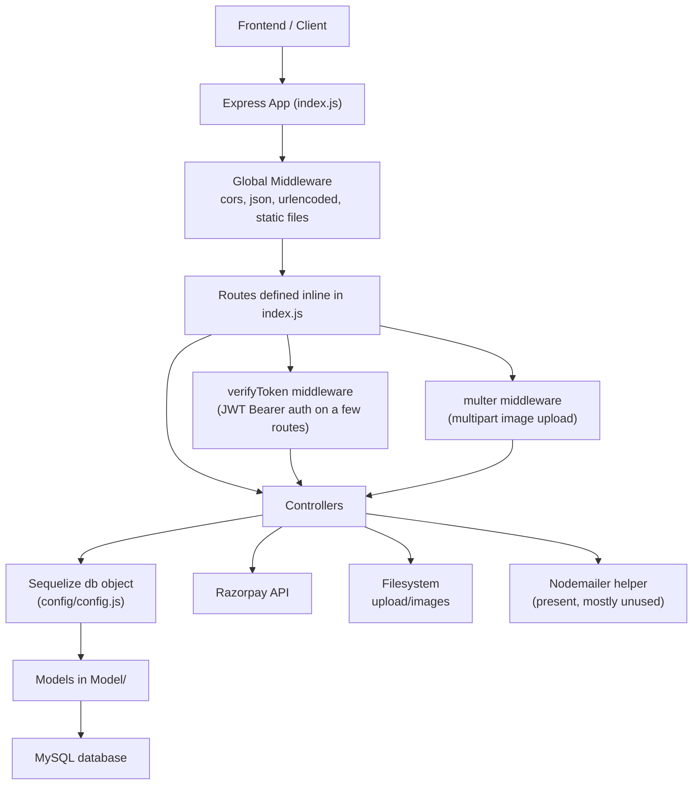
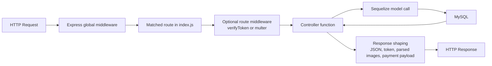
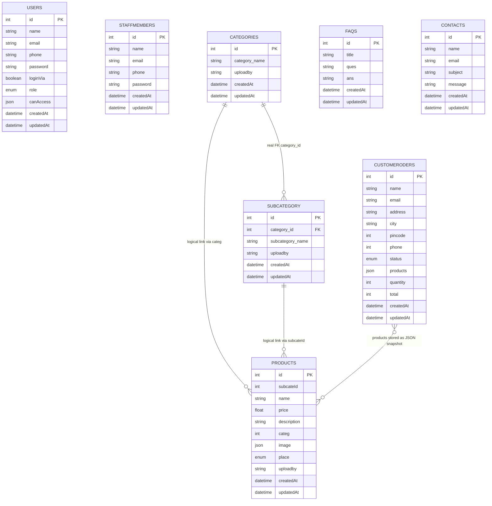
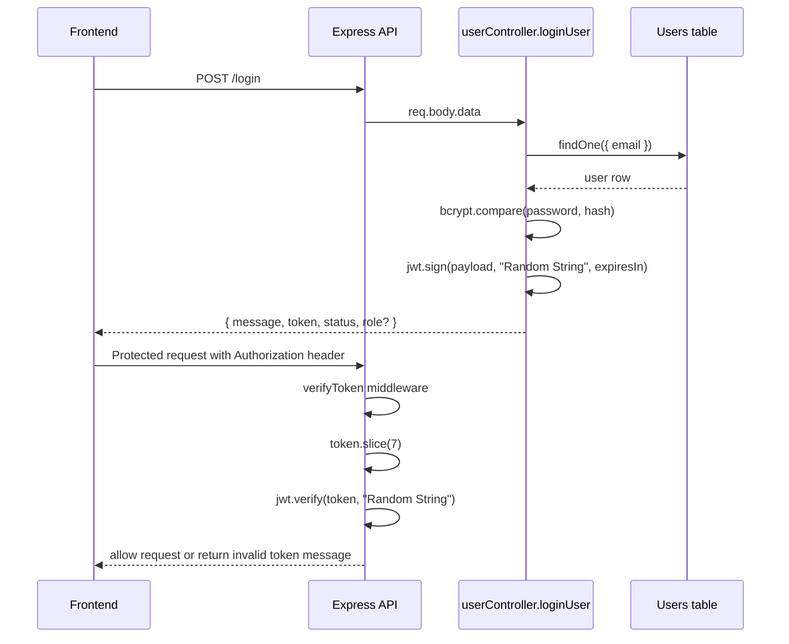
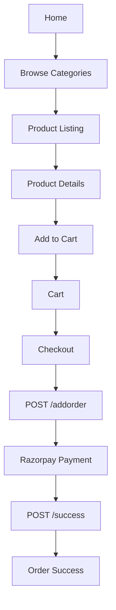
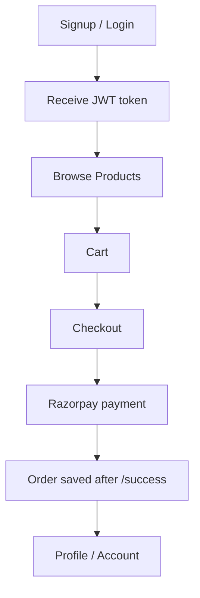
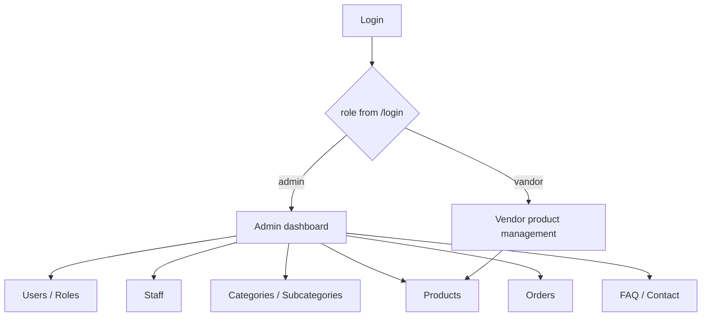

# Backend Study Guide

This document was generated by reading the source code in this repository.

Files inspected:
- `index.js`
- `config/config.js`
- `Model/*.js`
- `controllers/*.js`
- `middleware/*.js`
- `.env`

Important confidence note:
- This documentation is code-derived, not runtime-verified.
- I could not fully boot the app in the current workspace because dependencies are not installed yet. Running `node index.js` currently fails with `Cannot find module 'express'`.
- Database structure is inferred from Sequelize models and associations.
- Where Sequelize table names are not explicitly set, I call that out as an inference.

## Phase 1 - Project Overview

### Project purpose

This is a small e-commerce backend. It supports:
- user signup and login
- role and access updates
- staff member management
- category and subcategory management
- product creation, listing, filtering, and image uploads
- order creation with Razorpay payment verification
- FAQ management
- contact form submission

### What kind of application it is

It is a monolithic Express API server for an online store plus a lightweight admin/vendor panel.

It is not structured like a large enterprise backend. There are:
- no route modules
- no service layer
- no repository layer
- no DTO/validator layer

Instead, most business logic lives directly inside controller files.

### Overall architecture

At a high level, the app works like this:

1. `index.js` creates the Express server.
2. `config/config.js` connects Sequelize to MySQL, registers every model, and runs `sync({ alter: true })`.
3. `index.js` wires routes directly to controller functions.
4. Some routes use middleware:
   - `middleware/verifyToken.js` for JWT auth
   - `middleware/multer.js` for multipart image uploads
5. Controllers talk directly to Sequelize models from `config/config.js`.
6. Sequelize reads/writes MySQL tables.
7. For payments, the order flow also talks to Razorpay.
8. For uploaded product images, files are saved in `upload/images` and served statically from `/upload/images/...`.

### High-level architecture diagram

### Folder structure

| Path | Why it exists | What it contains | Study priority |
| --- | --- | --- | --- |
| `index.js` | Main entry point | Express app, middleware registration, every route | Highest |
| `config/` | Database setup | Sequelize connection, model loading, associations | Highest |
| `Model/` | Data definitions | Sequelize models for tables | Highest |
| `controllers/` | Business logic | CRUD, auth, product logic, payment flow | Highest |
| `middleware/` | Cross-cutting helpers | JWT auth, file upload, mail helper | Medium |
| `upload/images/` | Uploaded assets | Product image files served publicly | Medium |
| `upload/*.csv` | Manual data artifacts | CSV files not wired into any live route | Low |

### Technology stack

Core stack from `package.json`:
- Node.js
- Express 4
- Sequelize 6
- MySQL / MySQL2
- bcrypt
- jsonwebtoken
- multer
- Razorpay
- nodemailer
- cors
- dotenv

### Frameworks used

- Web framework: Express
- ORM: Sequelize
- Authentication style: JWT Bearer token
- File upload handling: Multer
- Payment gateway: Razorpay

### Database used

- MySQL
- Local config points to database `e_commerce` on `localhost` with user `root` and empty password in `config/config.js`
- There is also a commented hosted MySQL config in the same file, which suggests the project moved between local and hosted environments

### Authentication method

- JWT tokens signed with a hardcoded secret string: `"Random String"`
- Passwords hashed with bcrypt
- Auth middleware reads the `Authorization` header and expects `Bearer <token>`

### Main libraries and what they do

- `express`: HTTP API server
- `sequelize`: ORM and schema sync
- `mysql2`: Sequelize's MySQL driver
- `bcrypt`: password hashing
- `jsonwebtoken`: token creation and verification
- `multer`: product image uploads
- `razorpay`: payment order creation
- `nodemailer`: email helper
- `cors`: allow frontend cross-origin requests
- `dotenv`: loads Razorpay credentials from `.env`

### Environment variables and their purpose

Current `.env` variables:
- `RAZORPAY_KEY_ID`: public API key used when creating Razorpay orders
- `RAZORPAY_SECRET`: private key used for Razorpay order creation

Important architectural note:
- Database credentials are not taken from environment variables. They are hardcoded in `config/config.js`.
- The JWT secret is not taken from environment variables. It is hardcoded in `controllers/userController.js` and `middleware/verifyToken.js`.
- Gmail credentials in `middleware/mail.js` are also hardcoded.

### How the application starts

Startup path:

1. `node index.js`
2. `index.js` requires `./config/config`
3. `config/config.js`:
   - creates a Sequelize instance
   - authenticates the MySQL connection
   - registers all models onto the shared `db` object
   - runs `db.sequelize.sync({ alter: true })`
   - defines the `category -> subcategory` association
4. `index.js`:
   - creates an Express app
   - registers JSON, URL-encoded, CORS, and static-file middleware
   - registers all routes directly
   - starts listening on port `5001`

Important startup quirks:
- There is no `npm start` script in `package.json`.
- Port is hardcoded to `5001` in `index.js`.
- Schema syncing uses `alter: true`, so the app can mutate table structure on startup.

### Request lifecycle

Generic request path in this project:

### How data flows through the application

Typical data flow:

1. Client sends JSON or multipart form data.
2. Express parses body data.
3. Optional middleware does:
   - token verification
   - file upload handling
4. Controller reads `req.body`, `req.params`, and `req.query`.
5. Controller directly calls a Sequelize model.
6. Database returns rows.
7. Controller may transform the result before sending it back.

Examples of transformation:
- Product `image` is stored as JSON in MySQL, but some product endpoints parse it back into an array before returning it.
- Login returns a JWT instead of raw database data.
- `/addorder` does not save the order immediately. It first creates a Razorpay order and only saves to MySQL in `/success` after signature verification.

## Phase 2 - Folder Walkthrough

### `index.js`

Why it exists:
- This is the real application entry point.

What is inside:
- Express app creation
- global middleware
- static file serving for `/upload/images`
- every route definition in the project
- `app.listen(5001)`

How files interact:
- imports the shared `db` setup indirectly through controllers
- imports every controller directly
- imports `verifyToken` and `multer`

Entry points:
- `index.js` is the only server entry point

Reusable pieces:
- route definitions themselves are not reusable
- this file is best understood as the traffic map of the whole backend

Study first:
- Yes. Start here before any controller.

### `config/config.js`

Why it exists:
- Creates the Sequelize connection and central `db` object used everywhere else.

What is inside:
- MySQL connection config
- model registration
- schema sync
- category/subcategory association

How files interact:
- every controller imports `../config/config`
- models are initialized here, not in separate boot files

Entry points:
- runs as soon as anything requires the config module

Reusable pieces:
- the exported `db` object is reused by all controllers

Study first:
- Yes. Read it immediately after `index.js`.

### `Model/`

Why it exists:
- Holds the Sequelize definitions for each table.

Files inside:
- `signup.js`: user model
- `staffMember.js`: staff model
- `category.js`: categories
- `subCategory.js`: subcategories
- `product.js`: products
- `customerOrder.js`: orders
- `faq.js`: FAQs
- `contact.js`: contact messages

How files interact:
- model factory functions are imported and executed inside `config/config.js`
- controllers never import model files directly; they get them from `db`

Entry points:
- model files are not standalone entry points
- they are activated by `config/config.js`

Reusable pieces:
- models are the reusable data layer in this project

Study first:
- After `config/config.js`

### `controllers/`

Why it exists:
- Contains nearly all business logic in the app.

Files inside:
- `userController.js`
- `staffMemberController.js`
- `categoryController.js`
- `subCategoryController.js`
- `productController.js`
- `orderController.js`
- `faqCtrl.js`
- `contactController.js`
- `productController.zip` (not used by the app; likely a backup artifact)

How files interact:
- `index.js` calls controllers directly
- controllers call Sequelize models via `db`
- there is no service or repository layer between them

Entry points:
- controller functions referenced in `index.js`

Reusable pieces:
- controller helper logic is limited
- the main reusable helper in controllers is `modifiedProducts()` in `productController.js`

Study first:
- `userController.js`
- `productController.js`
- `orderController.js`
- then category/subcategory controllers
- then admin/support controllers like FAQ and contact

### `middleware/`

Why it exists:
- Holds helpers that sit between route and controller, or support controllers.

Files inside:
- `verifyToken.js`: verifies JWT from `Authorization` header
- `multer.js`: stores uploaded images in `upload/images`
- `mail.js`: sends email using a Gmail transporter

How files interact:
- `verifyToken` is used on `/addstaff` and `/addProduct`
- `multer` is used on product image routes
- `mail.js` is imported in `orderController.js` but the email-sending order flow is commented out

Entry points:
- route-level middleware on selected endpoints

Reusable pieces:
- `verifyToken` and `multer` are reusable
- `mail.js` is a helper function

Study first:
- `verifyToken.js`
- `multer.js`
- `mail.js` only after you understand the order flow

### `upload/`

Why it exists:
- Stores files that are part of the application data rather than source code.

What is inside:
- `upload/images/`: product image files
- `upload/product.csv`, `upload/test2.csv`: CSV files not connected to active routes

How files interact:
- Multer writes new files into `upload/images`
- Express serves them from `/upload/images/<filename>`
- Product rows only store image filenames, not full URLs

Study first:
- Medium priority
- understand it after product routes

## Phase 3 - Backend Flow

Important architecture truth:
- The intended flow is `Route -> Middleware -> Controller -> Model -> Database -> Response`
- There is no separate `Service` or `Repository` layer in this codebase

### Feature 1: User signup and login

Signup flow:
1. Route: `POST /signup` in `index.js:37`
2. Controller: `controllers/userController.js:9-45`
3. Model: `Model/signup.js`
4. Database table: `Users`
5. Behavior:
   - expects `req.body.data`
   - checks whether `email` already exists
   - hashes password with bcrypt
   - creates user
   - returns `{ message, status }`

Login flow:
1. Route: `POST /login` in `index.js:38`
2. Controller: `controllers/userController.js:49-118`
3. Model: `Model/signup.js`
4. Database table: `Users`
5. Behavior:
   - expects `req.body.data`
   - normal login path compares bcrypt password
   - social-login-style path is triggered when `loginVia` is truthy
   - issues JWT with hardcoded secret

Related user management:
- `PATCH /updateuser/:id` -> `controllers/userController.js:121-138`
- `DELETE /deleteUser/:id` -> `controllers/userController.js:141-160`
- `GET /getalluser` -> `controllers/userController.js:162-169`
- `GET /getuserbyid/:email` -> `controllers/userController.js:171-178`
- `PATCH /roleupdate/:id` -> `controllers/userController.js:180-215`

### Feature 2: Staff management

Flow:
1. Routes in `index.js:47-51`
2. Optional auth middleware: only `POST /addstaff` uses `verifyToken`
3. Controller: `controllers/staffMemberController.js`
4. Model: `Model/staffMember.js`
5. Table: `staffMembers`

Behavior:
- create, list, read single, update, delete staff entries
- password is hashed on create and update

### Feature 3: Categories and subcategories

Category flow:
1. Routes in `index.js:55-60`
2. Controller: `controllers/categoryController.js`
3. Model: `Model/category.js`
4. Table: `categories`

Subcategory flow:
1. Routes in `index.js:63-67`
2. Controller: `controllers/subCategoryController.js`
3. Model: `Model/subCategory.js`
4. Table: `subcategory`
5. Includes real Sequelize association to `category`

Important note:
- `GET /getallsubcategory` uses `include: [{ model: db.category }]`, so this is the one place where the backend returns a joined relational structure instead of plain rows.

### Feature 4: Products and image uploads

Create product flow:
1. Route: `POST /addProduct` in `index.js:70`
2. Middleware: `verifyToken`
3. Middleware: `multer.array('image')`
4. Controller: `controllers/productController.js:145-164`
5. Model: `Model/product.js`
6. Database table: inferred Sequelize default table for `Product`
7. Filesystem: image filenames stored in `upload/images`

Read product flow:
- `GET /getAllProduct` -> `controllers/productController.js:167-178`
- `GET /getSingleProduct/:id` -> `controllers/productController.js:180-195`
- `GET /getProductByCate/:id` -> `controllers/productController.js:198-211`
- `GET /getProductByCategAndSubCate/:subcate/:categ` -> `controllers/productController.js:213-227`

Product admin flow:
- `POST /updateProductImg/:id` -> `controllers/productController.js:243-281`
- `POST /specificImgDelete/:id/:index` -> `controllers/productController.js:283-317`
- `PATCH /updateProductDetail/:id` -> `controllers/productController.js:65-111`
- `DELETE /deleteProduct/:id` -> `controllers/productController.js:319-331`

Vendor/product management pagination flow:
- `GET /getproductbyvandor` -> `controllers/productController.js:333-373`
- `GET /getproManageByCate` -> `controllers/productController.js:375-399`
- `GET /getProManageBySub` -> `controllers/productController.js:401-424`
- `GET /getProOnNext` -> `controllers/productController.js:426-461`

Important product data detail:
- `image` is stored as JSON in the database
- many read endpoints parse it back into an array before returning it
- frontend must prepend `/upload/images/` to each filename to display images

### Feature 5: Orders and payments

This feature is split into two different HTTP requests.

Step A - create a Razorpay order:
1. Route: `POST /addorder` in `index.js:90`
2. Controller: `controllers/orderController.js:124-158`
3. External service: Razorpay
4. Database write: none

Step B - verify payment and persist order:
1. Route: `POST /success` in `index.js:94`
2. Controller: `controllers/orderController.js:160-197`
3. Verifies HMAC signature
4. On success, creates order in MySQL using `req.body.data`
5. Model: `Model/customerOrder.js`
6. Table: `customerOders` (note the typo in table name)

Order admin flow:
- `GET /getallorder` -> `controllers/orderController.js:9-21`
- `GET /getsingleorder/:id` -> `controllers/orderController.js:24-40`
- `DELETE /deleteorder/:id` -> `controllers/orderController.js:199-212`
- `PATCH /updateorder/:id` -> `controllers/orderController.js:214-229`

### Feature 6: FAQ

Flow:
1. Routes in `index.js:97-101`
2. Controller: `controllers/faqCtrl.js`
3. Model: `Model/faq.js`
4. Table: inferred Sequelize default table for `Faq`

### Feature 7: Contact

Flow:
1. Routes in `index.js:104-108`
2. Controller: `controllers/contactController.js`
3. Model: `Model/contact.js`
4. Table: inferred Sequelize default table for `contact`

## Phase 4 - Database

### Database model summary

| Logical entity | Source model file | Table name | Important fields | Why it exists |
| --- | --- | --- | --- | --- |
| User | `Model/signup.js` | `Users` | `name`, `email`, `phone`, `password`, `loginVia`, `role`, `canAccess` | login, signup, roles, access flags |
| StaffMember | `Model/staffMember.js` | `staffMembers` | `name`, `email`, `phone`, `password` | extra staff records separate from normal users |
| Category | `Model/category.js` | `categories` | `category_name`, `uploadby` | top-level product grouping |
| SubCategory | `Model/subCategory.js` | `subcategory` | `category_id`, `subcategory_name`, `uploadby` | second-level product grouping |
| Product | `Model/product.js` | inferred default for `Product` | `subcateId`, `name`, `price`, `description`, `categ`, `image`, `place`, `uploadby` | sellable catalog items |
| CustomerOrder | `Model/customerOrder.js` | `customerOders` | `name`, `email`, `address`, `city`, `pincode`, `phone`, `status`, `products`, `quantity`, `total` | persisted checkout orders |
| Faq | `Model/faq.js` | inferred default for `Faq` | `title`, `ques`, `ans` | FAQ content |
| Contact | `Model/contact.js` | inferred default for `contact` | `name`, `email`, `subject`, `message` | contact form submissions |

All models also get Sequelize's default timestamp fields:
- `createdAt`
- `updatedAt`

### Relationships

Real database-level relationship defined in code:
- `categories.id` -> `subcategory.category_id`

Logical relationships used by application code but not explicitly defined as Sequelize associations:
- `Product.categ` likely refers to `categories.id`
- `Product.subcateId` likely refers to `subcategory.id`
- `Product.uploadby` seems to store a vendor/user identifier as a string, not a foreign key
- `customerOrder.products` stores product snapshots in JSON, not foreign keys

### Foreign keys

Real foreign key declared in model:
- `subcategory.category_id` references `categories.id`

Not declared as foreign keys but used like references:
- `Product.categ`
- `Product.subcateId`

### Why each table exists

#### `Users`
- stores customer/admin/vendor accounts
- also stores role and frontend/admin permission flags in `canAccess`

#### `staffMembers`
- separate table for staff CRUD
- this is not linked to `Users`, which means staff are modeled independently rather than as a user subtype

#### `categories`
- top-level taxonomy for products

#### `subcategory`
- child taxonomy under category

#### `Product` table
- actual product catalog
- stores image filenames as JSON
- stores product placement like `Regular`, `Hot deal`, `Main carousel`, `Week deal`

#### `customerOders`
- checkout and payment result storage
- stores customer info and product data snapshot
- does not link to a user account

#### FAQ and contact tables
- content and support features for the public site/admin panel

### ER diagram

### Migrations

There are no Sequelize migration files in this repository.

Instead, schema management currently relies on:
- `sequelize.authenticate()` in `config/config.js`
- `db.sequelize.sync({ alter: true })` in `config/config.js`

What that means:
- tables can be auto-created on startup
- existing columns can be altered automatically
- schema history is not versioned
- production changes would be harder to track safely than with migrations

## Phase 5 - Authentication

### Login flow

Normal login:
1. Frontend calls `POST /login`
2. Controller looks up user by `req.body.data.email`
3. Controller compares plaintext password with bcrypt hash
4. On success, controller signs JWT with `"Random String"`
5. Response returns `token`, `status`, and `role`

Social-login-style path:
1. Frontend sends `loginVia: true`
2. If user does not exist, backend creates one directly from request body
3. Backend signs a JWT with a `1m` expiration
4. Response returns token and `status: true`

### Registration flow

1. Frontend calls `POST /signup`
2. Backend checks whether email already exists
3. Backend hashes password with bcrypt
4. Backend creates a row in `Users`
5. Backend returns a message, not the user row

### JWT/session handling

- JWT only, no server-side session storage
- tokens returned in response body, not in cookies
- middleware expects `Authorization: Bearer <token>`
- decoded token is attached to `req.decoded`

### Protected routes

Only these routes are protected in the current code:
- `POST /addstaff`
- `POST /addProduct`

Everything else is effectively public unless the frontend blocks access itself.

That includes routes you would normally expect to protect, such as:
- deleting users
- updating roles
- deleting products
- reading all orders
- updating orders
- FAQ admin routes
- contact admin routes

### Password hashing

Uses bcrypt in:
- `controllers/userController.js`
- `controllers/staffMemberController.js`

Hashed on:
- signup
- user update
- staff create
- staff update

Important caveat:
- update routes always attempt to hash `req.body.password`
- if frontend sends an update without a password, the code may hash `undefined`, which can break the stored password

### Token expiration

- normal login token: `1d`
- `loginVia` token: `1m`

### Refresh tokens

- none
- no refresh-token endpoint
- no logout endpoint
- no token rotation

### Authentication sequence diagram

## Important code quirks and frontend-impacting issues

These are worth knowing before you build the frontend:

1. Route names are inconsistent and sometimes misspelled.
   - Examples: `/getsignlecategory`, `/getproductbyvandor`, table `customerOders`

2. There is no dedicated API versioning or route grouping.
   - All endpoints live at the root path.

3. There is no service layer.
   - Your mental model should be route -> controller -> Sequelize model.

4. `GET /getsinglesubcat` looks broken.
   - Route in `index.js:65` has no `:id`, but controller reads `req.params.id` in `controllers/subCategoryController.js:31-40`.

5. `specificImgDelete` likely has a filesystem bug.
   - Controller deletes from `../uploads/` in `controllers/productController.js:293`, but actual files are stored in `upload/images`.

6. Product image update function is declared twice.
   - The later definition in `controllers/productController.js:243-281` is the active one.

7. Product pagination is done in memory.
   - Vendor listing endpoints fetch all matching products first, then slice arrays in JavaScript.

8. `getProOnNext` has flawed conditional logic.
   - Its first condition catches most cases before category/subcategory conditions can run.

9. Orders are not linked to users.
   - There is no `userId` in the order model.

10. Security is incomplete.
   - Many admin-style routes are unprotected.

## Phase 8 - Frontend Development Roadmap

Best build order:
1. Public catalog shell
2. Product browsing
3. Product details
4. Cart
5. Checkout and payment
6. Login/signup
7. Profile
8. Admin/vendor tools

Why this order:
- the product catalog is the core customer experience
- cart can be built entirely on the frontend because backend has no cart API
- checkout depends on order/payment endpoints
- admin screens can come later because they are operational tooling

### Page-by-page plan

#### 1. App shell / layout

- Purpose: shared header, footer, category nav, image URL helper
- APIs required: `GET /getallcategory`, `GET /getallsubcategory`
- Components needed: header, nav, footer, search placeholder, auth button, cart icon
- State required: category tree, auth token, cart count
- Loading states: skeleton nav
- Error states: fallback nav with retry
- Empty states: hide submenu if no categories
- User interactions: open nav, choose category, go to cart/login
- Navigation flow: base layout for every public page

#### 2. Home page

- Purpose: landing page showing featured products and entry points into shopping
- APIs required: `GET /getAllProduct`
- Components needed: hero, category strip, product carousels filtered by `place`
- State required: full product list or segmented featured lists
- Loading states: card skeletons
- Error states: retry banner
- Empty states: "No featured products yet"
- User interactions: open product details, browse category
- Navigation flow: home -> product details or category listing

#### 3. Category / product listing page

- Purpose: browse products by category and subcategory
- APIs required:
  - `GET /getProductByCate/:id`
  - `GET /getProductByCategAndSubCate/:subcate/:categ`
- Components needed: filter bar, product grid, breadcrumb
- State required: selected category, selected subcategory, product list
- Loading states: grid skeleton
- Error states: inline fetch error
- Empty states: "No products found in this category"
- User interactions: change filter, paginate on frontend if needed
- Navigation flow: category -> subcategory -> product details

#### 4. Product details page

- Purpose: show one product in full detail
- APIs required: `GET /getSingleProduct/:id`
- Components needed: image gallery, price block, description, add-to-cart button
- State required: product details, selected image index, quantity
- Loading states: detail skeleton
- Error states: not-found or fetch-failed state
- Empty states: missing image fallback
- User interactions: switch images, change quantity, add to cart
- Navigation flow: listing -> details -> cart

#### 5. FAQ page

- Purpose: public support content
- APIs required: `GET /getAllFaq`
- Components needed: accordion list
- State required: faq list, expanded item
- Loading states: accordion skeleton
- Error states: message with retry
- Empty states: "No FAQs available"
- User interactions: expand/collapse answers
- Navigation flow: header/footer -> FAQ

#### 6. Contact page

- Purpose: allow visitors to send support or inquiry messages
- APIs required: `POST /addcontact`
- Components needed: contact form
- State required: form fields, submit status
- Loading states: submit button spinner
- Error states: failed submission message
- Empty states: initial blank form
- User interactions: submit, reset
- Navigation flow: footer/header -> contact -> success toast

#### 7. Signup page

- Purpose: create account
- APIs required: `POST /signup`
- Components needed: form, inline validation, password visibility toggle
- State required: form, submit status
- Loading states: disabled submit button
- Error states: user exists / server error
- Empty states: normal initial state
- User interactions: submit, redirect to login or auto-login flow
- Navigation flow: signup -> login or home

#### 8. Login page

- Purpose: authenticate users and admins/vendors
- APIs required: `POST /login`
- Components needed: login form, remember token storage helper
- State required: form, token, role
- Loading states: disabled submit button
- Error states: wrong password, user not found
- Empty states: blank form
- User interactions: submit, redirect based on role
- Navigation flow:
  - customer -> home/profile
  - admin/vendor -> admin dashboard

#### 9. Cart page

- Purpose: stage products before checkout
- APIs required: none directly
- Components needed: cart table, quantity controls, summary
- State required: cart items, totals
- Loading states: none if local state only
- Error states: invalid quantity or stale product availability
- Empty states: "Your cart is empty"
- User interactions: remove item, change quantity, proceed to checkout
- Navigation flow: details -> cart -> checkout

Important note:
- There is no backend cart API, so cart should live in frontend state or local storage.

#### 10. Checkout page

- Purpose: collect shipping/contact details and start payment
- APIs required: `POST /addorder`
- Components needed: address form, order summary, pay-now button
- State required: checkout form, cart snapshot, payment intent/order object
- Loading states: order creation spinner
- Error states: Razorpay order creation failed
- Empty states: redirect if cart empty
- User interactions: submit address, launch payment flow
- Navigation flow: cart -> checkout -> payment -> success

#### 11. Payment handoff / Razorpay integration

- Purpose: complete payment
- APIs required:
  - `POST /addorder`
  - `POST /success`
- Components needed: payment launcher, verification handler
- State required: Razorpay order ids, payment ids, cart snapshot
- Loading states: verification spinner after payment
- Error states: payment cancelled, signature mismatch, server error
- Empty states: not applicable
- User interactions: pay, retry, return
- Navigation flow: checkout -> payment -> success

#### 12. Order success page

- Purpose: confirm order creation after payment verification
- APIs required: `POST /success` response data, optionally `GET /getsingleorder/:id`
- Components needed: success banner, order summary
- State required: order id, payment id, order snapshot
- Loading states: verification pending state
- Error states: verification failed
- Empty states: redirect if order context missing
- User interactions: continue shopping
- Navigation flow: success -> home or account

#### 13. Profile / account page

- Purpose: let user view/update profile
- APIs required:
  - `GET /getuserbyid/:email`
  - `PATCH /updateuser/:id`
- Components needed: profile form
- State required: user object, edit mode
- Loading states: profile skeleton
- Error states: failed fetch/update
- Empty states: user not found
- User interactions: edit profile, save
- Navigation flow: account menu -> profile

Important limitation:
- There is no "my orders" API scoped to the logged-in customer.

#### 14. Admin dashboard

- Purpose: entry point for admin/vendor work
- APIs required: multiple list endpoints
- Components needed: KPI cards, quick links, recent tables
- State required: counts derived from fetched lists
- Loading states: cards/table skeletons
- Error states: each widget can fail independently
- Empty states: zero-data cards
- User interactions: navigate into CRUD modules
- Navigation flow: login -> dashboard -> modules

#### 15. User management page

- Purpose: list users and update roles/access
- APIs required:
  - `GET /getalluser`
  - `PATCH /roleupdate/:id`
  - `DELETE /deleteUser/:id`
- Components needed: table, role editor, permission toggles
- State required: users, selected user, filter text
- Loading states: table skeleton
- Error states: failed update/delete
- Empty states: no users
- User interactions: edit role, toggle permissions, delete user

#### 16. Staff management page

- Purpose: manage staff records
- APIs required:
  - `GET /getstaffs`
  - `GET /getsinglestaff/:id`
  - `POST /addstaff`
  - `PATCH /updatestaff/:id`
  - `DELETE /deletestaff/:id`
- Components needed: table, create/edit modal
- State required: staff list, current form
- Loading states: table and modal loading
- Error states: duplicate email, failed save
- Empty states: no staff
- User interactions: create, edit, delete

#### 17. Category management page

- Purpose: manage top-level taxonomy
- APIs required:
  - `GET /getallcategory`
  - `POST /addcategory`
  - `PATCH /updatecategory/:id`
  - `DELETE /deletecategory/:id`
- Components needed: table, form
- State required: category list, draft form
- Loading states: list/form loading
- Error states: failed CRUD
- Empty states: no categories
- User interactions: create, rename, delete

#### 18. Subcategory management page

- Purpose: manage subcategories under categories
- APIs required:
  - `GET /getallsubcategory`
  - `POST /addsubcategory`
  - `PATCH /updatesubcat/:id`
  - `DELETE /removesubcate/:id`
- Components needed: linked category selector, table
- State required: category options, subcategory list
- Loading states: list loading
- Error states: failed CRUD
- Empty states: no subcategories
- User interactions: create, reassign category, delete

#### 19. Product management page

- Purpose: create/update/delete products
- APIs required:
  - `GET /getAllProduct`
  - `POST /addProduct`
  - `PATCH /updateProductDetail/:id`
  - `DELETE /deleteProduct/:id`
- Components needed: form, image uploader, table/grid
- State required: products, categories, subcategories, form state
- Loading states: list and upload progress
- Error states: upload failure, bad token, invalid form
- Empty states: no products
- User interactions: create, edit, delete, preview image

#### 20. Product image management page

- Purpose: append or remove images from an existing product
- APIs required:
  - `POST /updateProductImg/:id`
  - `POST /specificImgDelete/:id/:index`
- Components needed: gallery manager
- State required: image list, upload queue
- Loading states: upload/delete spinner
- Error states: delete bug or path mismatch
- Empty states: no images
- User interactions: add image, delete image

#### 21. Order management page

- Purpose: monitor and update orders
- APIs required:
  - `GET /getallorder`
  - `GET /getsingleorder/:id`
  - `PATCH /updateorder/:id`
  - `DELETE /deleteorder/:id`
- Components needed: order table, detail drawer, status editor
- State required: orders, selected order, filters
- Loading states: table/detail loading
- Error states: fetch/update/delete failure
- Empty states: no orders
- User interactions: inspect order, change status

#### 22. FAQ management page

- Purpose: manage FAQ entries
- APIs required:
  - `GET /getAllFaq`
  - `POST /addFaq`
  - `PATCH /updateFaq/:id`
  - `DELETE /deleteFaq/:id`
- Components needed: faq table and editor
- State required: faq list, current item
- Loading states: list/editor loading
- Error states: CRUD failure
- Empty states: no FAQs
- User interactions: create, edit, delete

#### 23. Contact inbox page

- Purpose: view and manage incoming contact messages
- APIs required:
  - `GET /getAllcontact`
  - `GET /getcontact/:id`
  - `PATCH /updatecontact/:id`
  - `DELETE /deletecontact/:id`
- Components needed: inbox list, detail view
- State required: message list, selected message
- Loading states: list/detail loading
- Error states: fetch/update/delete failure
- Empty states: no messages
- User interactions: view, update, delete

## Phase 9 - Frontend API Mapping

| Page | APIs | Reusable components | Global state | Local state | Edge cases |
| --- | --- | --- | --- | --- | --- |
| App shell | `/getallcategory`, `/getallsubcategory` | header, nav, footer | auth token, cart | menu state | categories fail to load |
| Home | `/getAllProduct` | hero, product cards | cart, auth | featured groups | no featured products |
| Category listing | `/getProductByCate/:id`, `/getProductByCategAndSubCate/:subcate/:categ` | breadcrumb, filters, grid | cart | selected filters | empty category |
| Product details | `/getSingleProduct/:id` | gallery, price block | cart | quantity, selected image | missing image array |
| FAQ | `/getAllFaq` | accordion | none | expanded row | empty FAQ list |
| Contact | `/addcontact` | form | none | form submit state | submit failure |
| Signup | `/signup` | auth form | auth after success if you auto-login | form state | existing email returns `200` with failure status |
| Login | `/login` | auth form | token, role, user email | form state | token expires, bad password |
| Cart | none | cart row, summary | cart | quantity changes | stale prices after refresh |
| Checkout | `/addorder` | address form, summary | cart, auth | shipping fields | empty cart |
| Payment | `/addorder`, `/success` | payment launcher | cart, auth | razorpay ids | signature mismatch |
| Order success | `/success` response, optional `/getsingleorder/:id` | success card | cart reset | order snapshot | refresh loses context |
| Profile | `/getuserbyid/:email`, `/updateuser/:id` | profile form | auth token, user identity | edit state | update without password |
| User management | `/getalluser`, `/roleupdate/:id`, `/deleteUser/:id` | admin table | auth role | selected user | backend route unprotected |
| Staff management | `/getstaffs`, `/addstaff`, `/updatestaff/:id`, `/deletestaff/:id` | CRUD table/modal | auth token | form state | only create is protected |
| Category management | `/getallcategory`, `/addcategory`, `/updatecategory/:id`, `/deletecategory/:id` | CRUD form/table | auth role | draft form | category delete with products not handled |
| Subcategory management | `/getallsubcategory`, `/addsubcategory`, `/updatesubcat/:id`, `/removesubcate/:id` | CRUD form/table | auth role | selected category | broken single-subcategory route |
| Product management | `/getAllProduct`, `/addProduct`, `/updateProductDetail/:id`, `/deleteProduct/:id` | uploader, table, editor | auth token | multipart form state | images required on create |
| Product image manager | `/updateProductImg/:id`, `/specificImgDelete/:id/:index` | gallery manager | auth token | upload/delete state | delete route likely buggy |
| Order management | `/getallorder`, `/getsingleorder/:id`, `/updateorder/:id`, `/deleteorder/:id` | table, detail panel | auth role | status editor | orders are not tied to users |
| FAQ management | `/getAllFaq`, `/addFaq`, `/updateFaq/:id`, `/deleteFaq/:id` | CRUD editor | auth role | form state | no server validation |
| Contact inbox | `/getAllcontact`, `/getcontact/:id`, `/updatecontact/:id`, `/deletecontact/:id` | inbox list/detail | auth role | selected message | GET returns `201` instead of `200` |

## Phase 10 - User Journey

### Guest user

### Logged-in user

Important limitation:
- Logged-in users do not get a dedicated "my orders" API.
- Orders are not tied to `userId`, so customer history is weak on the backend side.

### Admin / vendor

## Phase 11 - Learning Order

### 1. Start with `index.js`

Why first:
- it shows the whole API surface
- it tells you what features exist
- it shows which routes use middleware and which do not

### 2. Read `config/config.js`

Why second:
- you need to know how Sequelize is initialized before reading model or controller behavior
- it also reveals the only explicit association in the app

### 3. Read every file in `Model/`

Why third:
- models define the real data shape
- frontend forms, tables, and validation depend on these fields

### 4. Read `middleware/verifyToken.js` and `middleware/multer.js`

Why fourth:
- auth and file upload affect how you call endpoints from the frontend

### 5. Study `controllers/userController.js`

Why fifth:
- auth controls how the whole frontend session works
- user role information also influences admin routing

### 6. Study `controllers/productController.js`

Why sixth:
- products are the center of the storefront
- this controller contains the most logic, including image handling and pagination-like behavior

### 7. Study `controllers/orderController.js`

Why seventh:
- checkout is the most sensitive user flow
- this controller explains why `/addorder` and `/success` are separate

### 8. Study category and subcategory controllers

Why eighth:
- they explain how catalog navigation is built
- they are simpler once you already understand product relationships

### 9. Study admin/support controllers

Files:
- `staffMemberController.js`
- `faqCtrl.js`
- `contactController.js`

Why ninth:
- they are mostly straightforward CRUD
- easier after you understand the common patterns

### 10. Read the API reference and OpenAPI spec

Files:
- `docs/api-reference.md`
- `docs/openapi.yaml`

Why tenth:
- once you know the code, the docs become much easier to trust and use
- this is where you turn backend understanding into frontend implementation planning

### 11. Build the frontend in slices, not all at once

Recommended slice order:
1. app shell + categories
2. product listing
3. product detail
4. cart
5. checkout + Razorpay
6. auth
7. profile
8. admin/vendor tooling

Why this comes last:
- now you understand both the backend shape and its quirks
- you can design frontend state and error handling around real backend behavior instead of assumptions

